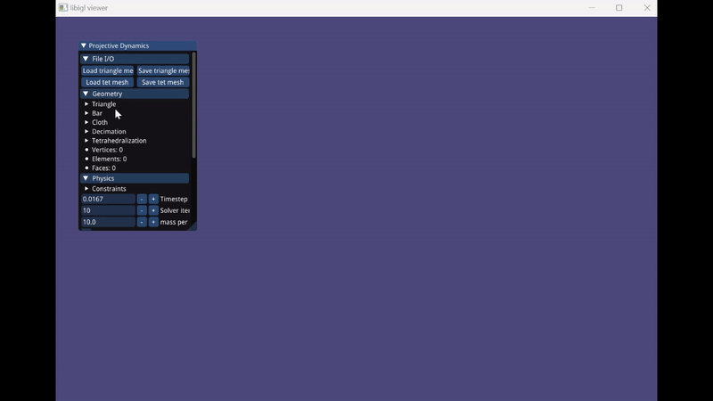
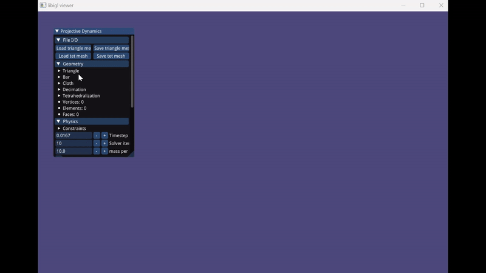

# Shape Targeting with Projective Dynamics
## Overview

This repo contains an implementatoin of *Shape Targeting: A Versatile Active Elasticity Constitutive Model* [[ paper link]](https://history.siggraph.org/wp-content/uploads/2022/08/2020-Talks-Klar_Shape-Targeting-A-Versatile-Active-Elasticity-Constitutive-Model.pdf) 
with Projective Dynamics Framework.

Main PD framework modified from [Q-Minh's implementation with PD](https://github.com/Q-Minh/projective-dynamics).

### Shape Targeting demo
For comparison
-  **without target**
(i.e St matrix being identity). After turning off gravity, the bar bounces up due to elasticity.

-  **with target**
After turning off gravity, bar bends downward.


#### Other Constraint types 
*from original implementation*
-  **positional**
-  **edge length**

-  **deformation gradient**

-  **strain limiting**


## Dependencies

- C++17 compiler
- [libigl](https://libigl.github.io/)

[libigl](https://libigl.github.io/) is included in the project using CMake's FetchContent and pulls in [Eigen](https://eigen.tuxfamily.org/index.php?title=Main_Page), [glfw](https://www.glfw.org/), [Dear ImGui](https://github.com/ocornut/imgui) and [TetGen](http://wias-berlin.de/software/index.jsp?id=TetGen&lang=1) with it.

## Building

```
# Download repository
$ cd projective-dynamics

# Configure and build project
$ cmake -S . -B build
$ cmake --build build --target pd --config Release

# Run the program
$ ./build/Release/pd.exe
```
